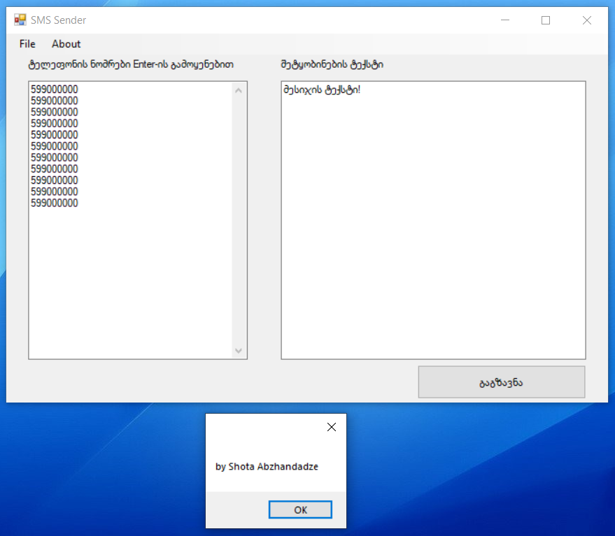

# Georgian-SMS-Sender-via-VPN
Georgian SMS Sender via VPN ეს არის პროგრამა, რომელიც დაგეხმარებათ VPN-ის მეშვეობით გააგზავნოთ SMS-ები, შესაძლებელია სიის ჩაგდება და 300 მეტი SMS-ის გაგზავნა ერთდროულად. 
http://YOURADDRESS/mt/oneway?username=YOURUSERNAME&password=YOURPASSWORD&client_id=YOURCLIENTID&service_id=YOURSERVICEID&to= 
აქ უნდა ჩაწეროთ თქვენი SMS პროვაიდერის VPN მონაცემები: YOURADDRESS,YOURUSERNAME,YOURPASSWORD, YOURCLIENTID. 
OneWay Service SMS via VPN 
URL: http://IP_ADDRESS/mt/oneway? 
username – client username provided by SMS Provider 
password – client password provided by SMS Provider 
client_id – unique client ID provided by SMS Provider 
service_id – unique service ID provided by SMS Provider 
to – subscriber msisdn 
text – message text 

by Shota Abzhandadze

